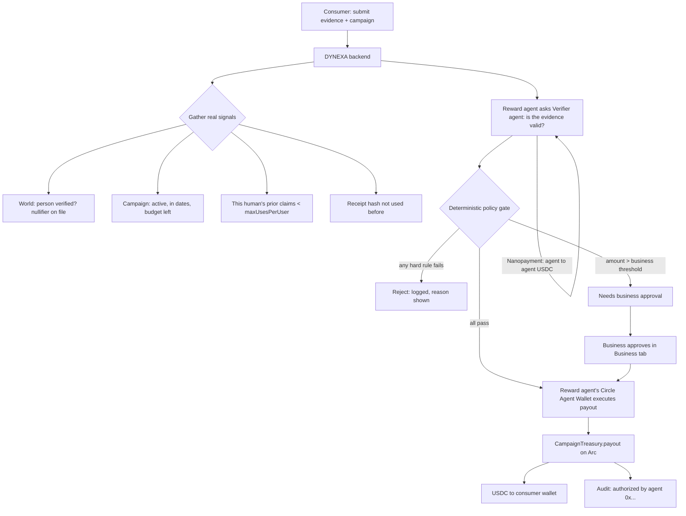

# Architecture

DYNEXA pays USDC (or a branded GiftToken) to verified people who prove a real
purchase, under limits the business controls. An autonomous agent runs the
decision; it never chooses the amount and never holds an unbounded wallet.

## Actors and wallets

| Actor | Wallet | Why |
|---|---|---|
| Consumer | Privy embedded wallet (email/phone login, no seed phrase) | receives the reward |
| Business | Privy wallet with a spending policy | funds the campaign treasury, approves large payouts |
| Reward agent | Circle Agent Wallet `0x7b17…4164` | sends the USDC payout / mints the gift, autonomously |
| Verifier agent | Circle Agent Wallet `0x7fa4…49f4` | checks the evidence; paid 0.001 USDC per check by the reward agent |

## Reward flow

## Why the agent is safe

Three independent limits, any one of them stops an over-payment:

1. **The AI never sees the amount.** It returns `{valid, reason}` on the evidence
   only. The amount is the campaign's fixed `rewardPerUser`.
2. **The deterministic policy engine.** Plain code, no AI. Checks the campaign
   state (budget, per-human count, duplicate receipt, dates) before anything is
   sent. A compromised or hallucinating verifier can't get past it.
3. **Circle Agent Wallet limits.** The agent's wallet has spending limits and an
   allowlist (mainnet); on testnet Circle still refuses to broadcast a call that
   would revert.
4. **The contract limits.** `CampaignTreasury` checks `msg.sender == agent`,
   enforces the per-transaction cap and the total campaign budget on-chain, and
   rejects a replayed claim id. Even a direct call from the agent can't overpay.

## Agent decision logic

Inputs, all real signals:

| Signal | Source |
|---|---|
| Person verified, unique | World Selfie Check nullifier |
| Evidence valid | Verifier agent (AI vision on the receipt / product photo) |
| Receipt not reused | `receipts.receipt_hash` unique |
| Campaign active, in dates, funded | campaign row + on-chain treasury balance |
| Prior claims by this human | count of `claims` for this nullifier |
| Amount within limits | campaign `max_per_tx`, `total_budget` |

Output: `pay` · `reject(reason)` · `needs_human_approval` (amount over the
business threshold).

## Circle products used

- **Arc** — settlement chain (testnet chain 5042002).
- **USDC** — the reward token; also the gas token on Arc.
- **Agent Stack / Agent Wallets** — the reward agent and verifier agent wallets,
  operated through Circle CLI, constrained by spending limits and allowlists.
- **Nanopayments** — the reward agent pays the verifier agent per evidence check
  (agent-to-agent USDC, sub-cent, gasless).
- **Paymaster** — (stretch) sponsors the consumer's gas on GiftToken redemption
  so the reward is not spent on fees.

## Stack

TypeScript monorepo. Next.js web app (Customer and Business tabs). Node backend
with the agents. PostgreSQL for the claim pipeline and audit trail. Foundry
contracts, viem for EVM calls.
